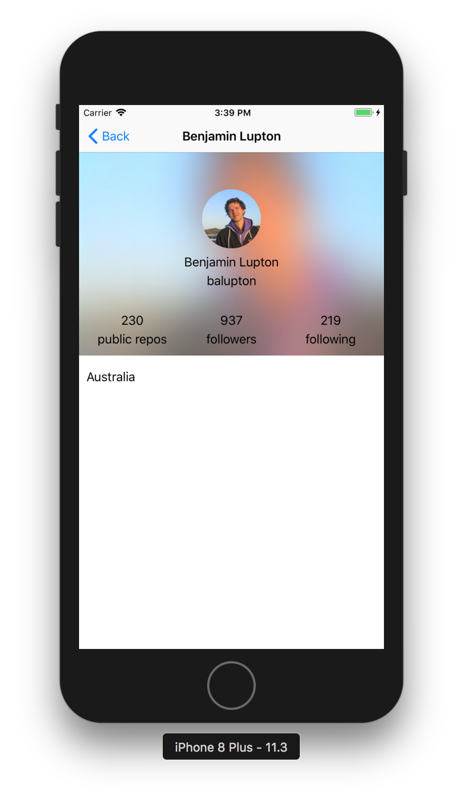

# GitHub-Followers

This app lets you search for any Github user, to see who follows them.

I have implemented a simple UI that displays the followers of a given GitHub user in a grid. 
1. You can search for any github username. I've used GitHub’s API to fetch all the data.
2. Each row in the grid has three cells and each cell displays the avatar and username of that follower. 
3. Tapping on a cell should take you to a separate screen where you can see the details of the follower: name, email, location, repo count, following count, and follower count.

While building this app I initially, mistakely tried to fetch data for all the followers. This resulted in me hitting the rate-limits for Guthub API. But then I changed it so that details for a follower is requested only when you tap on the user picture.

